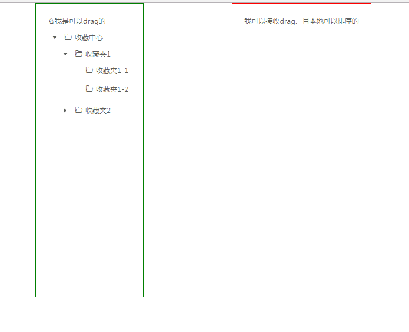

# 使用react-dnd+antd tree实现两个列表的拖拽数据传递
以下功能
1. DragSource可拖拽到DragTarget中，DragTarget动态添加节点
2. DragTraget可实现拖拽排序功能

## 效果图:



# 使用
```
git clone https://github.com/vonxq/TreeDragDemo.git
npm i 或 yarn
npm start 或 yarn start
```
# 源码讲解
[使用react-dnd+antd tree实现两个列表的拖拽数据传递](https://vonxq.github.io/2017/09/20/front-end/React/Practice/drag/)
## 附录
采用create-react-app快速构建
代码结构如下：
```
my-app/
  README.md
  node_modules/
  package.json
  public/
    index.html
    favicon.ico
  src/
    App.css
    App.js
    App.test.js
    index.css
    index.js
    logo.svg
```
